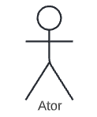

# Casos de Uso

## Histórico de versão

|Data | Versão | Modificação | Autor(es)|
| -- | -- | -- | -- |
| 04/02/2022 | 0.1 | Criação do documento e tabelas de caso de Uso | [Kayro César](https://github.com/kayrocesar) |
| 04/03/2022 |  0.2   | Adição da parte téorica do Diagrama de casos de Uso |  [Klyssmann Oliveira](https://github.com/klyssmannoliveira)   |
| 05/03/2022 |  0.3   | Diagrama de casos de Uso |  [Klyssmann Oliveira](https://github.com/klyssmannoliveira) e  [Kayro César](https://github.com/kayrocesar)  |
| 05/03/2022 |  0.4   | Revisão |  [Eduardo Maia](https://github.com/eduardomr) e  [José Luís](https://github.com/joseluis-rt)  |
| 19/04/2022 |  0.5   | Correções |   [Kayro César](https://github.com/kayrocesar)  |

## 1. Introdução

   Casos de uso podem ser produzidos de maneira textual ou em forma de diagramas. Na maneira textual, os documentos são utilizados para especificar requisitos e possuem um detalhamento maior que as histórias de usuário. A recomendação é sejam escritos na fase de especificação dos requisitos e geralmente são escritos pelos próprios desenvolvedores do sistema, mas podem ser compreendidos e validados pelos usuários (VALENTE, 2020).

   Já o diagrama de caso de uso é uma forma usada na análise do sistema para identificar, esclarecer e organizar os requisitos do sistema que são empregados em UML (Unified Modeling Language), uma notação padrão para a modelagem de objetos e sistemas do mundo real (ALERYANI, 2016). 

 
    Existem quatro símbolos principais  que são utilizados nos diagramas de caso de uso: (1) Atores; (2) Casos de uso; (3) Associação; e (4) Sistema de fronteira. A tabela 1 apresenta estes simbolos.

 

 Tabela 1: Simbolos do Diagrama de Casos de Uso

| Notação | Função | Símbolo |
| :-: | :--: | :-: |
| (1) Atores | É uma pessoa ou um grupo de pessoas fora do sistema desempenha um papel em uma ou mais interações com o sistema, representa de onde a informação vem e para onde vai  |  |
| (2) Casos de uso | Mostra todas as funções do sistema  |   |
| (3) Associação | Representa a conexão entre casos de uso e atores. A relação "estender" pode ocorrer ou não (Opcional), já a relação "incluir" deve ocorrer (Obrigatório)  |   |
| (4) Sistema de fronteira | Determina o limite do sistema  |   |

 Fonte: Elaboração dos autores

 

## 2. Metodologia

    No documento de casos de uso textual, o  primeiro aspecto a ser incluso é a utilização de uma perspectiva de um ator que deseja utilizar o sistema para atingir um determinado objetivo. O ator costuma ser um usuário humano e um elemento externo em relação ao sistema. Primeiramente, o caso de uso enumera os passos a serem realizados pelo ator e cada caso possui duas listas de passos (fluxo normal e extensões. O fluxo normal é o caminho ideal a ser percorrido pelo usuário, já as extensões representam caminhos alternativos na execução de um passo ou possíveis situações de erro (VALENTE, 2020).

 

## 3. Resultados

    Utilizando a metodologia apresentada, foi produzido um diagrama de casos de uso geral (que engloba todos os casos de uso apresentados individualmente) e vários diagramas de caso de uso individuais na forma de diagrama e na forma textual representada em tabela.

 
 

### 3.1. Casos de uso geral

   <figcaption>Figura 1 - Diagrama de casos de uso</figcaption>
    
   <figcaption>Fonte: Elaboração dos autores.</figcaption>

    
    
  <a href="https://raw.githubusercontent.com/Requisitos-de-Software/2021.2-PontoFacil/2ade84aa739cb7395cf80503f3d3edd3f8566105/docs/assets/imagens/diagrama_use_case_PontoFacil.svg" target="_blank">Clique aqui</a> para ver o diagrama em tela cheia.

###  3.2. Registrar o ponto 
 

 Tabela 2: Caso de uso - Registrar o ponto

| Fluxo | Passo |Ação |  Ator | RF |
| :---: | :---: |:---: | :---: | :---: |
| Normal | 
1
 |Funcionário seleciona a opção de registrar o ponto  | Funcionário de uma empresa | [RF01, RF02, RF03, RF08](https://requisitos-de-software.github.io/2021.2-PontoFacil/elicitacao/priorizacao/moscow/) |
| Normal | 
2 
  |Funcionário informa o horário do registro do ponto  |Funcionário de uma empresa | - |
| Normal |
3
 |Funcionário informa alguns dados adicionais acerca do registro do ponto como foto e descrição (Opcional)|Funcionário de uma empresa | [RF18, RF31](https://requisitos-de-software.github.io/2021.2-PontoFacil/elicitacao/priorizacao/moscow/) |
| Normal | 
4
 | Aplicativo salva o registro do ponto  |Funcionário de uma empresa|- |
| Normal | 
5
 | Aplicativo mostra que o registro do ponto foi realizado com sucesso |Funcionário de uma empresa|- |
| Extensão| 
2a
 |Funcionário informa um horário inválido (solicitar horário novamente)  |Funcionário de uma empresa |- | 

 Fonte: Elaboração dos autores

 
 

### 3.3. Registrar falta
 

 Tabela 3: Caso de uso - Registrar falta

| Fluxo | Passo |Ação |  Ator | RF |
| :---: | :---: |:---: | :---: | :---: |
| Normal | 
1
 |Funcionário seleciona a opção de registrar falta  | Funcionário de uma empresa | [RF17](https://requisitos-de-software.github.io/2021.2-PontoFacil/elicitacao/priorizacao/moscow/) |
| Normal |
2
 |Funcionário informa se quer registrar falta com ou sem abono ou inferior a um dia|Funcionário de uma empresa | - |
| Normal | 
3 
  |Funcionário informa a duração da sua falta (dia(s) ou horas) |Funcionário de uma empresa | - |
| Normal | 
4
 | Aplicativo salva o registro da falta  |Funcionário de uma empresa|- |
| Normal | 
5
 | Aplicativo mostra que o registro da falta foi realizado com sucesso |Funcionário de uma empresa|- |
| Extensão| 
2a
 |Funcionário informa uma duração  (dias ou horas) inválida (solicitar duração novamente)  |Funcionário de uma empresa |- | 

 Fonte: Elaboração dos autores

 

  
  
  

### 3.4. Apagar registros passados
 

 Tabela 4: Caso de uso - Apagar registros passados

| Fluxo | Passo |Ação |  Ator | RF |
| :---: | :---: |:---: | :---: | :---: |
| Normal | 
1
 |Funcionário seleciona o registro desejado  | Funcionário de uma empresa |- |
| Normal | 
2 
  |Funcionário seleciona a opção de apagar |Funcionário de uma empresa | - |
| Normal |
3
 |Aplicativo pergunta se o usuário tem certeza da escolha|Funcionário de uma empresa | - |
| Normal | 
4
 | Aplicativo apaga o registro desejado  |Funcionário de uma empresa|[RF05 e RF23](https://requisitos-de-software.github.io/2021.2-PontoFacil/elicitacao/priorizacao/moscow/)|

 Fonte: Elaboração dos autores

  
  

### 3.5. Ativar a notificação de alarme 
 

 Tabela 5: Caso de uso -  Ativar a notificação de alarme 

| Fluxo | Passo |Ação |  Ator | RF |
| :---: | :---: |:---: | :---: | :---: |
| Normal | 
1
 |Funcionário seleciona a opção para ativar a notificação de alarme  | Funcionário de uma empresa | - |
| Normal | 
2 
  |Funcionário escolhe se deseja ativar alarme para : começar o trabalho e/ou  encerrar trabalho e/ou iniciar intervalo e/ou retornar do intervalo   |Funcionário de uma empresa | - |
| Normal | 
3
 | Aplicativo ativa o alarme de acordo com o especificado pelo usuário  |Funcionário de uma empresa|[RF28](https://requisitos-de-software.github.io/2021.2-PontoFacil/elicitacao/priorizacao/moscow/) |

 Fonte: Elaboração dos autores

  
  

### 3.6. Realizar Backup dos registros
 

 Tabela 6: Caso de uso -  Realizar Backup dos registros 

| Fluxo | Passo |Ação |  Ator | RF |
| :---: | :---: |:---: | :---: | :---: |
| Normal | 
1
 |Funcionário seleciona a opção para realizar o Backup  | Funcionário de uma empresa |- |
| Normal | 
2 
  |Funcionário seleciona se deseja realizar backup de forma local ou em nuvem |Funcionário de uma empresa |-  |
| Normal | 
3
 | Aplicativo faz o backup de todos os registros |Funcionário de uma empresa|[RF28](https://requisitos-de-software.github.io/2021.2-PontoFacil/elicitacao/priorizacao/moscow/)|-|
| Extensão | 
2a 
 |Funcionário selecionou o backup em nuvem e quer ativar o backup automático |Funcionário de uma empresa | - |

 Fonte: Elaboração dos autores

  
  

### 3.7. Gerar extrato de registros
 

 Tabela 7: Caso de uso - Gerar extrato de registros 

| Fluxo | Passo |Ação |  Ator | RF |
| :---: | :---: |:---: | :---: | :---: |
| Normal | 
1
 |Funcionário seleciona a opção para gerar um extrato dos seus registros  | Funcionário de uma empresa |- |
| Normal | 
2 
  |Funcionário seleciona o intervalo de datas que o extrato deve levar em conta  |Funcionário de uma empresa |-  |
| Normal |
3
 |Funcionário seleciona quais critérios devem ser incluídos no extrato(dia, semana , mês)  |Funcionário de uma empresa |-  |
| Normal | 
4
 |Aplicativo gera o extrato  |Funcionário de uma empresa|[RF32](https://requisitos-de-software.github.io/2021.2-PontoFacil/elicitacao/priorizacao/moscow/)|
| Normal | 
5
| Aplicativo informa que o extrato foi gerado e pergunta se o usuário deseja abri-lo  |Funcionário de uma empresa|-|
| Extensão| 
2a
 |Funcionário seleciona o intervalo de datas inválido (solicitar o intervalo novamente) |Funcionário de uma empresa|-|
|

 Fonte: Elaboração dos autores

  
  

### 3.8. Visualizar inconsistências nos registros de ponto  
 

 Tabela 8: Caso de uso - Visualizar inconsistências nos registros de ponto

| Fluxo | Passo |Ação |  Ator | RF |
| :---: | :---: |:---: | :---: | :---: |
| Normal | 
1
 |Funcionário seleciona a opção para visualizar as inconsistências nos registros de ponto | Funcionário de uma empresa |- |
| Normal | 
2 
  |Aplicativo exibe a lista de inconsistências (cada item da lista possui uma data) e a quantidade total das mesmas |Funcionário de uma empresa |[RF12](https://requisitos-de-software.github.io/2021.2-PontoFacil/elicitacao/priorizacao/moscow/)    |

 Fonte: Elaboração dos autores

  
  

   

## 4. Legenda

RF - Requisito Funcional  
Extender -  
Incluir - Relacionamento deve ocorrer (Obrigatório)  

## 5. Referências

>VALENTE, Marco Túlio. Engenharia de Software Moderna: Princípios e Práticas para Desenvolvimento de Software com Produtividade, 2020.

>ALERYANI, Arwa Y. Comparative study between data flow diagram and use case diagram. International Journal of Scientific and Research Publications, v. 6, n. 3, p. 124-126, 2016.

