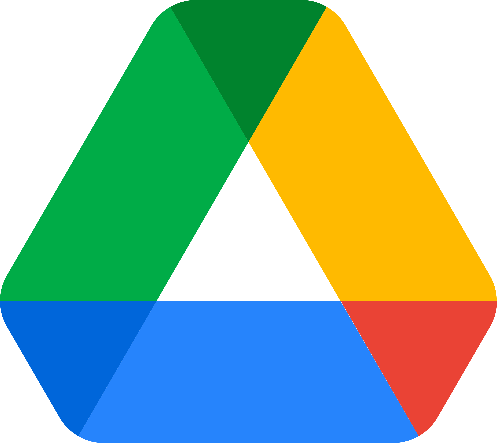

# Ferramentas de documentação e comunicação

## Histórico de versão

|    Data    | Versão |                Modificação                |       Autor        |
| :-------- | :---- | :--------------------------------------- | :---------------- |
| 02/02/2022 |  0.1   | Criação do documento e elaboração do texto |  [@klyssmannoliveira](https://github.com/klyssmannoliveira)   |
| 03/02/2022 | 0.2 | Ajuste das logos das ferramentas | [@klyssmannoliveira](https://github.com/klyssmannoliveira)  |
| 02/02/2022 |  0.3   | Revisão e correção de logos |  [@eduardomr](https://github.com/eduardomr)   |
| 04/04/2022 |  0.4   | Adição de novas ferramentas |   [@klyssmannoliveira](https://github.com/klyssmannoliveira)    |

## Objetivo:

Este documento visa esclarecer entre os envolvidos no projeto as ferramentas que serão utilizadas ao longo desse projeto.

| Logo | Nome | Função |
| :---: | :---:| :--- |
|  | Whatsapp | Ferramenta na qual, majoritariamente, toda comunicação via texto ocorre. |
|  | Discord | Ferramenta na qual, majoritariamente, toda comunicação via videochamada ocorre. |
|  | GitHub | Pelo GitHub disponibilizamos a documentação, arquivos do projeto, separação de tarefas e verificamos o andamento do projeto. Se utiliza das diversas funções presentes na plataforma para que a comunicação e atribuições entre os membros da equipe ocorra de forma clara e rápida. |
|  | Google Drive | Ferramenta utilizada para compartilhamento de documentos e imagens referentes ao projeto entre os membros da equipe. |
|  | Diagrams.net | Ferramenta utilizada para criação de diagramas e UML durante o projeto. |
|  | YouTube | Ferramenta utilizada para hospedar as gravações das apresentações. |
|  | Figma | Ferramenta utilizada para criação do protótipo de alta fidelidade. |
