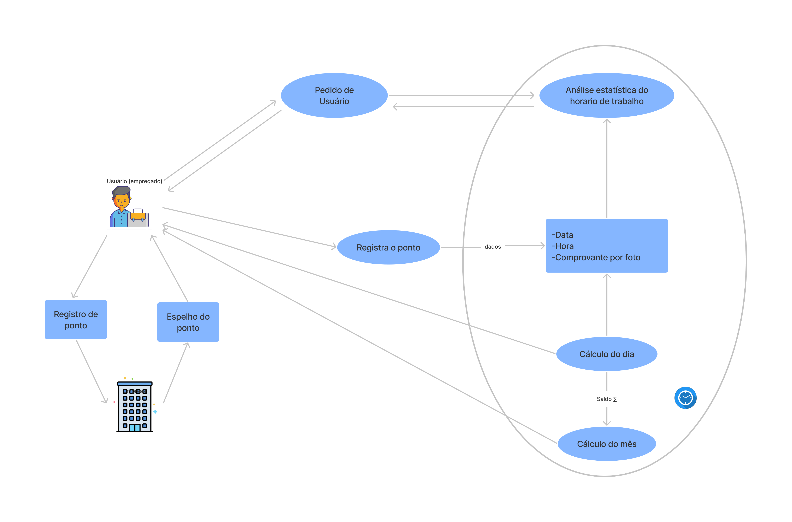
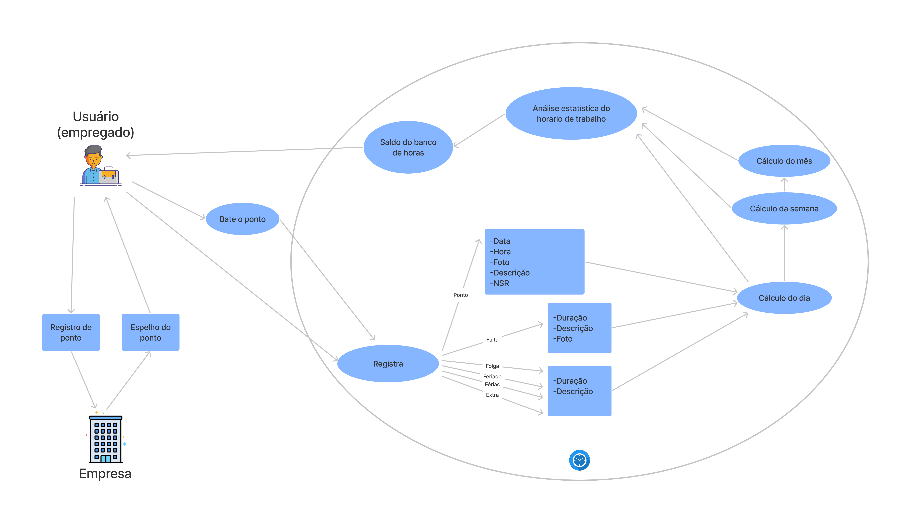

# RichPicture

##  Histórico de Versão

|   Data   | Versão |           Descrição           |             Autor(es)              |
|:--------:|:------:|:-----------------------------:|:----------------------------------:|
| 29/01/2022 |  0.1   |    Esboço do RichPicture    | [Klyssmann Oliveira](https://github.com/klyssmannoliveira)|
| 02/01/2022 |  1.0   |  RichPicture realizado no [Figma]("https://www.figma.com/")  |   [Kayro César](https://github.com/kayrocesar)|
| 03/01/2022 |  2.0   |  RichPicture aprimorado no [Figma]("https://www.figma.com/")  |   [Kayro César](https://github.com/kayrocesar)|
| 18/02/2022 |  2.1  | Correção de estruturação do documento , inserção de legenda e fonte nas imagens  |  [Kayro César](https://github.com/kayrocesar)|
| 20/04/2022 |  3.0   |    Melhoria da metodologia   | [Klyssmann Oliveira](https://github.com/klyssmannoliveira)|
| 21/04/2022 |  3.1   |    Inserção das Referências  | [Kayro César](https://github.com/kayrocesar) |

## 1. Introdução

Um Rich Picture é um desenho que visa representar os principais elementos de um problema para apoiar e proporcionar uma melhor compreensão por parte da equipe de desenvolvimento.

## 2. Metodologia

    Primeiramente, foi realizado um rich picture em papel para ilustrar uma idéia geral do funcionamento do aplicativo e a partir disso foram realizadas mais duas versões aprimoradas utilizando a ferramenta <a href="https://www.figma.com/">Figma</a>. Além disso, os dois autores se encontraram pela ferramenta <a href="https://requisitos-de-software.github.io/2021.2-PontoFacil/planejamento/ferramentas/">Discord</a> onde utilizaram o aplicativo simulando um usuário em diversas situações para a elaboração do documento. A reunião não foi garavada.

### 2.1 RichPicture primeira versão acerca do fluxo geral de funcionamento do Ponto Fácil 

 
<figcaption> Figura 1 - RichPicture inicial  <figcaption> 

  

 
 <figcaption> Fonte: Elaboração dos autores <figcaption>

 

### 2.2 RichPicture segunda versão acerca do fluxo geral de funcionamento do Ponto Fácil 

 
<figcaption> Figura 2 - Rich Picture segunda versão<figcaption> 

  

 
<figcaption> Fonte: Elaboração dos autores <figcaption>

### 2.3 RichPicture terceira versão acerca do fluxo geral de funcionamento do Ponto Fácil 

   
<figcaption> Figura 3 -  Rich Picture terceira versão<figcaption> 

   
   

   
<figcaption> Fonte : Elaboração dos autores <figcaption> 

 
## 3. Referências

> STEVENS, Kaye. Rich Pictures.7 jul. 2020. Disponível em: https://www.betterevaluation.org/en/evaluation-options/richpictures. Acesso em: 2 fev. 2022

> RICH pictures. [S. l.], 16 fev. 2018. Disponível em: http://systems.open.ac.uk/materials/T552/pages/rich/richAppendix.html. Acesso em: 2 fev. 2022.